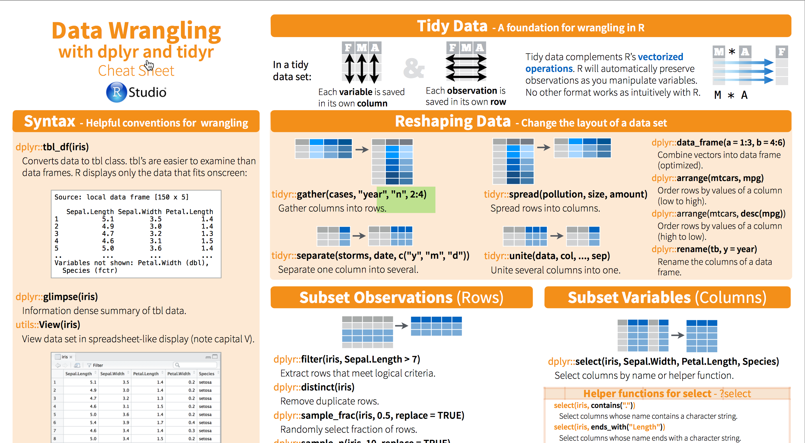

```{r setup, include=FALSE}
options(htmltools.dir.version = FALSE, tidy=TRUE, dev='svg')
```

## Tidyverse

- Tidyverse is relatively new part of R ecosystem with its own rules.

- Tidyverse libraries stem from common philosophy and are designed to work together.

- Tidyverse starts from the structure of an data frame (a tibble in tidy slang) and its functions use tibble as input and return tibble as output.

- Tidyverse is designed to work with pipes `%>%`.

- Tidyverse has dedicated graphis system based on "grammar of graphics" ggplot2 library and its many siblings.

---

## Load your libraries


```{r}
library(tidyverse)
library(stringr)
library(nycflights13)
```

---

## Create RStudio project from GitHub repo. 

1. Create GitHub repo and call it `dplyr_demo`. 

2. Clone this repo into RStudio project. 

3. Detailed instructions can be found [here](https://rstats-tartu.github.io/createrstudioprojectfromgithub/).

---

## Download example dataset from GitHub

- Dataset is called **Average monthly wage with additional payments** and you can find it in the healthcare_personnel_salary.tsv file in [rstats-tartu/salary](https://github.com/rstats-tartu/salary) repo. 

- Average monthly wage with additional payments dataset contains salary data of full- and part-time health care personnel of different occupations from Estonian Health Statistics database. 

- Values are in euros.

---

## Download healthcare_personnel_salary.tsv file

```{r, eval=FALSE}
dir.create("data")

url <- "https://raw.githubusercontent.com/rstats-tartu/datasets/master/healthcare_personnel_salary.tsv"

download.file(url, "data/healthcare_personnel_salary.tsv")
```

---

## Import healthcare_personnel_salary.tsv file

- Data is in the tab separated format, so we use `read_csv()` function from "readr" library

```{r}
salary <- read_tsv("data/healthcare_personnel_salary.tsv")
## we also prepare label 
label <- "Average monthly wage\nwith additional payments"
```


---
class: inverse, middle, center

# Tidy your data

---

## Changing data from wide to long

- Tidyverse expects your data in the long format: each row contains one value.

- Therefore it's important to convert your wide data to the long format.

---

## Salary table

"salary" is in the wide format after import, each variable has one column:

```{r}
salary
```

---

### Throw our data naively into `gather()`

- We can use function `gather()` from "tidyr" library. 
- `gather()` has arguments "key" and "value" for variables and values, respectively. 
```{r}
salary_long <- gather(salary)
salary_long
```

---

- We want Year in a separate column and occupation as key and wages as values. 

- We specify here Year as non-value column by using exclusion -Year (all other columns are considered as values).

```{r}
salary_long <- gather(salary, key = occupation, value = wage, -Year)
salary_long
```


---

```{r, fig.align='center',fig.height=5,fig.width=8}
library(ggthemes)
ggplot(salary_long, aes(Year, wage, color = occupation)) + 
  geom_point() + 
  geom_line() +
  scale_color_colorblind()
```


---

## Spread

- Let's say that **now we want each year in a separate column**.
- `spread()` from "tidyr" makes tidy go backward, from long to wide:

```{r}
salary_spread <- spread(salary_long, key = Year, value = wage)
salary_spread
```

---

class: inverse, middle, center

# dplyr and its five verbs

---

## dplyr and its five verbs

- You can complete most of your data wrangling tasks using five verbs from "dplyr" library.

- NB! Check the [data wrangling cheatsheet](https://www.rstudio.com/wp-content/uploads/2015/02/data-wrangling-cheatsheet.pdf) and dplyr help for further details. 

```{r,out.height=300,echo=FALSE}

```


---

## `select()` columns

`select()` selects, renames, and re-orders columns.

Select columns occupation and years 2011 to 2012:
```{r}
select(salary_spread, occupation, `2011`:`2012`)
```

---

To select 3 columns and rename *Resident physicians* to *Residents* and put Year as the last column:
```{r}
select(salary, Physicians, Residents = `Resident physicians`, Year)
```

---

To select all cols, except "Physicians", you can use minus `-` sign to exclude columns:
```{r}
select(salary, -Physicians)
```

---

### Helper functions you can use within select() to select columns

- `starts_with("Den")`: matches names that begin with "Den"

- `ends_with("nicians")`: matches names that end with "nicians"

- `contains("care")`: matches names that contain "care"

- `matches("^[[:digit:]]")`: selects variables that match a regular expression. This one matches any variables that start with number. 

- `num_range("X", 1:3)` matches X1, X2 and X3.

---
class: middle


```{r}
select(salary, starts_with("Den"))
```

---
class: middle

```{r}
select(salary, ends_with("nicians"))
```

---
class: middle

```{r}
select(salary, contains("phy"))
```

---
class: middle

```{r}
select(salary_spread, matches("[[:digit:]]"))
```


---

### Move variable to the front and rename variable

```{r}
# Move Radiology technicians variable to the front
select(salary, `Radiology technicians`, everything())
```

---

## Renaming

- `select()` keeps only the variables you specify
- `rename()` keeps all variables

```{r}
rename(salary, Residents = `Resident physicians`)
```


---

## `filter()` rows

- Keep rows in "salary_long" that have Year 2014 **and** wage over 1500.

```{r}
filter(salary_long, Year == 2014 & wage > 1500)
```

---

- Keep rows in "salary_long" that have occupation "Physician" **or** wage < 600.

```{r}
filter(salary_long, occupation == "Physicians" | wage < 600)
```

---

- Keep rows in "salary_long" that have occupation not "Physician" **or** wage < 600.

```{r}
filter(salary_long, occupation != "Physicians" | wage < 600)
```

---

Filtering with regular expression: we keep the rows where *occupation* starts with the "Den".
```{r}
filter(salary_long, str_detect(occupation, "^Den")) 
```

---

## Remove NAs with `filter()`. 

- We can use `starwars` dataset from "dplyr", where we can find several unhairy characters like C-3PO and R2-D2 with NA in hair_color variable.

```{r}
starwars
```

---

```{r}
filter(starwars, !is.na(hair_color))
```


---

## `summarise()`

Many rows summarised to a single value:
```{r}
salary_long %>% 
  summarise(Mean = mean(wage), 
            SD = sd(wage), 
            N = n())
```

---

## Count things

- `n()` loeb üles, mitu väärtust läks selle summary statistiku arvutusse,
- `n_distinct()` loeb üles, mitu unikaalset väärtust läks samasse arvutusse.

>Summarise on kasulikum, kui teda kasutada koos järgmise verbi, `group_by()`-ga.

---

## `group_by()`

`group_by()` groups values for summarising or mutating.

Here we calculate mean salary for each occupation:
```{r}
salary_long %>% 
  group_by(occupation) %>% 
  summarise(Mean = mean(wage), 
          SD = sd(wage), 
          N = n())
```

---

- `summarise()` argumendid on indentsed eelmise näitega aga tulemus ei ole. 
Siin me rakendame summarise verbi mitte kogu tabelile, vaid 8-le virtuaalsele tabelile, mis on saadud algsest tabelist lüües selle lahku vastavalt ametile. 

- `group_by()`-le saab anda järjest mitu grupeerivat muutujat. 
Siis ta grupeerib kõigepealt neist esimese järgi, seejärel lõõb saadud grupid omakorda lahku teise argumendi järgi ja nii edasi kuni teie poolt antud argumendid otsa saavad.

---

Here we group "storms" dataset by two categories and calculate average wind speed and standard deviation. 
If you change the order of grouping categories it affects only the column and row order of the result, try it:
```{r}
storms 
```

---

```{r}
storms %>% 
  group_by(status, category) %>% 
  summarise(Mean = mean(wind), 
          SD = sd(wind), 
          N = n())
```

---

## `mutate()`

Mutate põhikasutus on siiski uute veergude tekitamine, mis võtavad endale inputi rea kaupa. Seega tabeli ridade arv ei muutu.

Mutate adds new columns (and its close cousin `transmute()` creates new columns while losing the previous columns).

---

## Transform wage data

- Here we create new column of log10-transformed values from the *wage* column, and name it *log_wage*.

```{r,fig.height=3,fig.align='center'}
salary_long %>% 
  mutate(log_wage = log10(wage)) %>% 
  gather(key, value = "wage", -Year, -occupation) %>% 
  ggplot(aes(wage)) + 
  geom_histogram(bins = 6) +
  facet_wrap(~key, scales = "free")
```

---

## flights dataset from "nycflights13" library

```{r}
flights
```

---

```{r}
gain <- select(flights, 
       year:day, 
       ends_with("delay"), 
       carrier,
       tailnum,
       distance, 
       air_time) %>% 
  mutate(gain = arr_delay - dep_delay,
         hours = air_time / 60,
         gain_per_hour = gain / hours)
gain
```


---

```{r, fig.height=4, fig.align='center'}
gain %>% 
  ggplot(aes(gain_per_hour)) +
  geom_histogram(bins = 60) +
  facet_wrap(~carrier, scales = "free_y")
```


